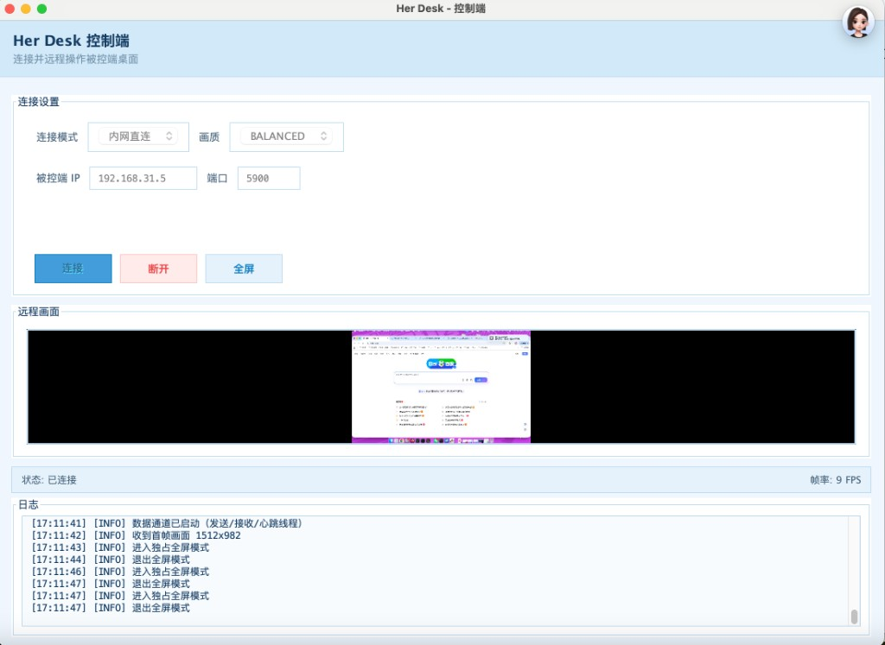
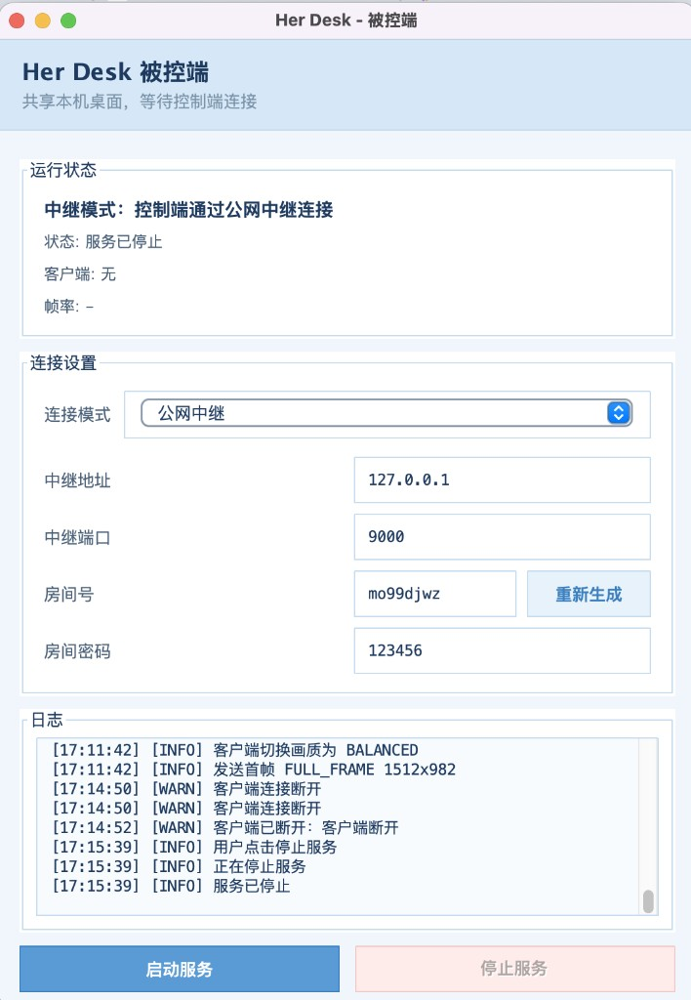
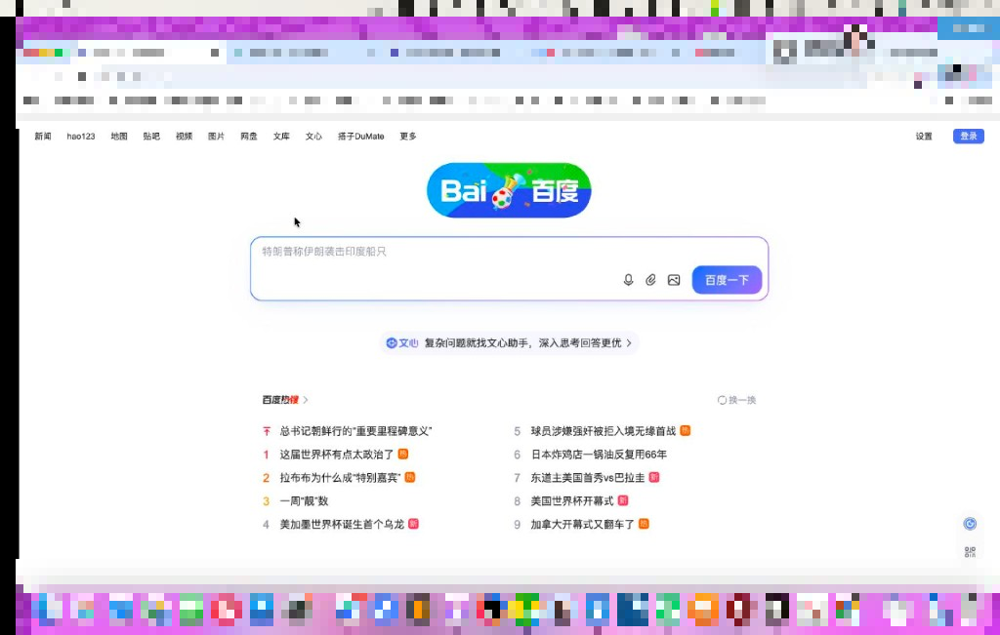
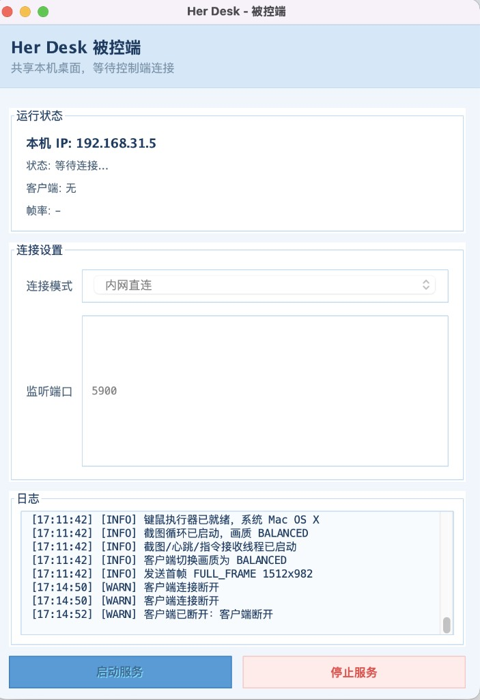
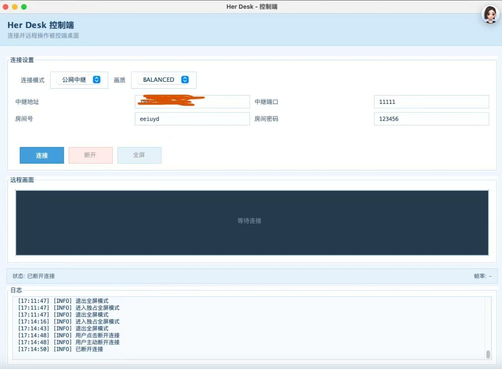

# Her Desk - Java 远程桌面工具

纯 Java 实现的远程桌面工具，**一个 JAR** 同时包含被控端、控制端与公网中继，适用于 Windows / macOS，JDK 8 ~ JDK 21 均可运行。

支持 **内网直连** 与 **公网中继** 两种连接方式，无需浏览器、无需额外依赖。

---

## 产品预览

### 内网直连 — 局域网即连即用

被控端启动服务后，控制端填入 IP + 端口即可远程操控，键鼠完整支持。



### 公网中继 — 跨网房间号配对

无需端口映射，被控端自动生成房间号 + 密码保护，控制端填相同信息即可连接。



### 全屏沉浸 — 像坐在电脑前操作

一键全屏铺满屏幕，Esc 或右上角按钮退出，多次进出稳定可靠。



### 被控端 / 控制端界面





---

## 功能特性

| 类别 | 能力 |
|------|------|
| 连接 | 内网 TCP 直连（默认 5900）、公网中继穿透、房间密码、随机房间号 |
| 画面 | 增量差分传输、三档画质、静止降频 / 操作提速、Retina 适配 |
| 控制 | 完整键鼠、全屏模式、单客户端独占 |
| 运维 | 全程日志面板、中文错误提示、实时 FPS 显示 |
| 部署 | JAR 双击运行，可打包 macOS DMG / Windows EXE |

---

## 快速开始

### 内网直连

```
1. 被控端：构建 JAR → 配置权限 → 启动服务
2. 控制端：连接模式选「内网直连」→ 填被控端 IP + 端口 5900 → 连接
```

### 公网中继

```
1. VPS：java -jar her-desk-relay.jar 9000
2. 被控端：选「公网中继」→ 填中继地址/端口 → 记下房间号 → 密码 123456 → 启动服务
3. 控制端：填相同中继地址/端口/房间号/密码 → 连接
```

---

## 构建与运行

### Maven 打包

```bash
mvn clean package
```

产物：`target/her-desk-1.0.0.jar`（主程序）、`target/her-desk-relay.jar`（中继）

若 `mvn package` 报 Nexus 403，改用 `mvn compile` 后手动 `jar cfm` 打包（见 `target/MANIFEST.MF`）。

### 命令行启动

```bash
java -jar target/her-desk-1.0.0.jar          # 模式选择
java -jar target/her-desk-1.0.0.jar server   # 被控端
java -jar target/her-desk-1.0.0.jar client   # 控制端
java -jar target/her-desk-relay.jar 9000     # 公网中继
```

### 启动脚本

| 脚本 | 平台 | 作用 |
|------|------|------|
| `scripts/run*.command` / `run*.bat` | Mac / Win | 启动器、被控端、控制端、中继 |
| `scripts/package-mac.command` | macOS | 生成 DMG 安装包（需 JDK 17+） |
| `scripts/package-windows.bat` | Windows | 生成 EXE 安装包（需 JDK 17+） |

macOS 首次运行 `.command` 若无法打开：`chmod +x scripts/*.command`

### 原生安装包（DMG / EXE）

面向普通用户分发时，运行打包脚本即可生成**内置 JRE** 的安装包（约 50 MB），用户无需安装 Java。

- macOS：`./scripts/package-mac.command` → `target/dist/Her Desk-1.0.0.dmg`
- Windows：`scripts\package-windows.bat` → `target\dist\Her Desk-1.0.0.exe`

> `jpackage` 不能跨平台打包，Mac 产物须在 Mac 上生成，Windows 产物须在 Windows 上生成。

---

## 公网中继

```
控制端 ──► 公网 Relay ◄── 被控端
         （相同房间号 + 密码配对后双向转发）
```

两端均在界面 **连接模式 → 公网中继** 填写：

| 字段 | 说明 |
|------|------|
| 中继地址 | VPS 公网 IP 或域名 |
| 中继端口 | Relay 监听端口（如 9000） |
| 房间号 | 被控端自动生成 8 位，两端须一致 |
| 房间密码 | 默认 `123456`，填错拒绝接入 |

VPS 部署：

```bash
java -jar target/her-desk-relay.jar 9000
```

防火墙须放行对应 TCP 端口。被控端须**先启动注册**，控制端再加入。

> 当前版本密码明文传输、无 TLS，公网使用请尽快改用复杂密码。

---

## 权限配置（必读）

### macOS 被控端

被控端 Mac **必须**授权以下两项，否则只能看到壁纸或无法控制：

| 权限 | 路径 | 勾选对象 |
|------|------|----------|
| **屏幕录制** | 系统设置 → 隐私与安全性 → 屏幕录制 | 终端 / IDE / java |
| **辅助功能** | 系统设置 → 隐私与安全性 → 辅助功能 | 同上 |

修改权限后须**完全退出并重启**被控端，仅重连无效。控制端 Mac 一般无需特殊权限。

### Windows 被控端

放行防火墙 **TCP 5900** 入站（首次弹窗点允许，或手动添加入站规则）。控制端无需特殊权限。

---

## 画质档位

| 档位 | 适用场景 |
|------|----------|
| 高清晰 | 看文字、写代码 |
| 均衡 | 默认日常使用 |
| 流畅 | 网络一般或卡顿时 |

卡顿时可切「流畅」、优先有线或 5GHz Wi-Fi，控制端底部可查看实时 FPS。

---

## 常见问题

**连接超时？** 确认被控端已启动、IP/端口正确；公网模式检查 VPS 端口与 Relay 进程；查看日志面板（15 秒超时详情）。

**ROOM_NOT_FOUND？** 被控端未注册或房间号不一致，确认被控端先启动。

**房间密码错误？** 两端密码须一致，默认 `123456`。

**Mac 只能看到壁纸？** 屏幕录制权限未生效，按上文配置后重启被控端。

**能看画面但点不动？（Mac）** 辅助功能权限未授权。

**全屏黑屏？** 请使用最新版 JAR，可按 Esc 退出全屏。

**mvn package 403？** 改用 `mvn compile` + 手动打 JAR。

**找不到 JAR？** 先执行 `mvn clean package` 或使用 `scripts/run*.command`。

---

## 版本说明

| 未实现 | 已实现 |
|--------|--------|
| 文件传输 / 剪贴板 | 内网直连、公网中继 |
| 多控制端同时连接 | 房间密码、随机房间号 |
| TLS 加密、账号体系 | 日志面板、全屏模式 |

---

## 支持作者

开源不易，维护、调试、写文档都要投入大量时间。如果 **Her Desk** 对你有帮助，欢迎通过微信打赏一点心意——哪怕是一杯咖啡的钱，也是对项目最好的鼓励。

本仓库为 **开源学习版**，供学习、研究与二次开发参考，**不包含商业授权或技术支持承诺**。

若你有 **商业定制、私有化部署、功能扩展、技术合作** 等需求，欢迎扫码添加微信，我们详聊。

| 微信打赏 | 添加微信 |
|:--------:|:--------:|
|  |  |
| 扫码打赏，感谢支持 | 扫码添加，商业合作详聊 |

---

## 许可证

内网自用工具，按需自由使用与修改。
